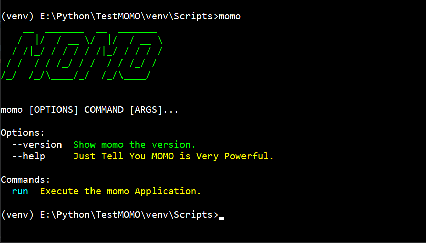

\$ momo\_
==========

Momo是一款基于Python实现的轻量级的自动学习工具，它基于browser webdrive实现了在“www.xuexi.com”网站上自动打开图文或者视频连接，并自动实现浏览器页面自动
向下翻页功能，用以模拟人的真实阅读行为。如果扫码登录还能自动累计积分哦！

Installing
----------

Install and update using `pip`_:

.. code-block:: text

    $ pip install --editable .

MOMO supports Python 3.5 and newer.

.. _pip: https://pip.pypa.io/en/stable/quickstart/

A Usage Example
----------------

What does it look like? Here is an example of a simple Click program:

Links
-----

*   Documentation: https://github.com/liuweicai/momo
*   Code: https://github.com/liuweicai/momo
